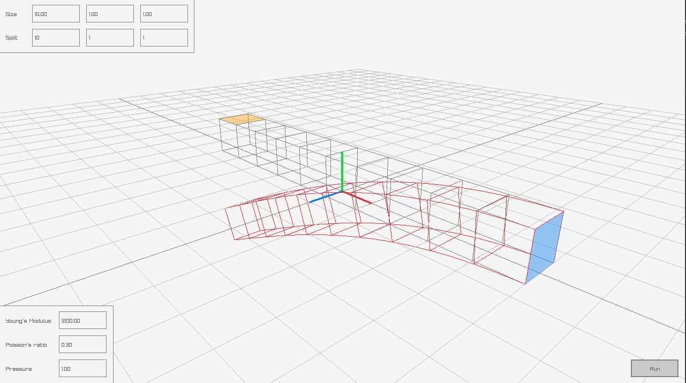

# Body deformation using Finite Element Method

This is a "simple" implementation of body deformation simulation using Finite Element Method (FEM) written in 
Go Programming Language with the help of raylib (for visualization and UI) and gonum (for solving linear systems).

